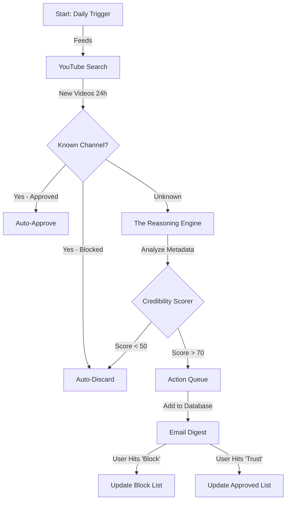

# Agent Blueprint: The Consciousness Content Scout

## 1. The Mission
To act as an intelligent filter for new YouTube content related to Consciousness, UFOs, and NDEs, separating high-signal research from low-signal noise.

## 2. The Architecture

## 3. The Components

### The "Eyes" (Inputs)
- **Source**: YouTube Data API
- **Frequency**: Once every 24 hours
- **Queries**: "Consciousness research", "UAP evidence", "Near Death Experience study", etc.

### The "Brain" (LLM Reasoning)
- **Role**: Analyze video titles, descriptions, and channel names against the Credibility Rubric.
- **Output**: A structured JSON object containing:
  - `credibility_score` (0-100)
  - `reasoning` (Why did it get this score?)
  - `tags` (e.g., #UAP, #Academic, #GrifterAlert)

### The "Hands" (Actions)
- **Database**: Store accepted videos.
- **Notification**: Send an email summary.
- **Learning**: Update the `trusted_channels.json` and `blocked_channels.json` files based on user feedback.
